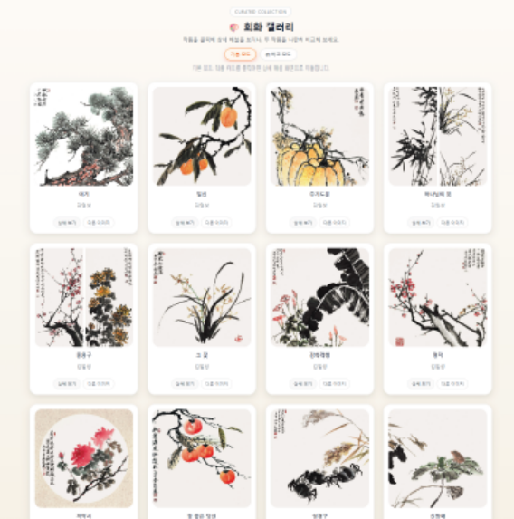
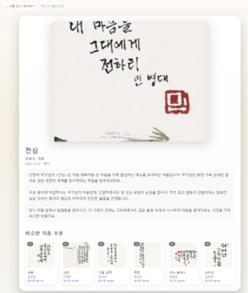
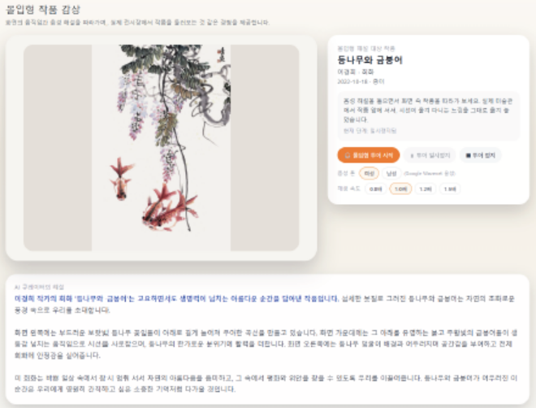
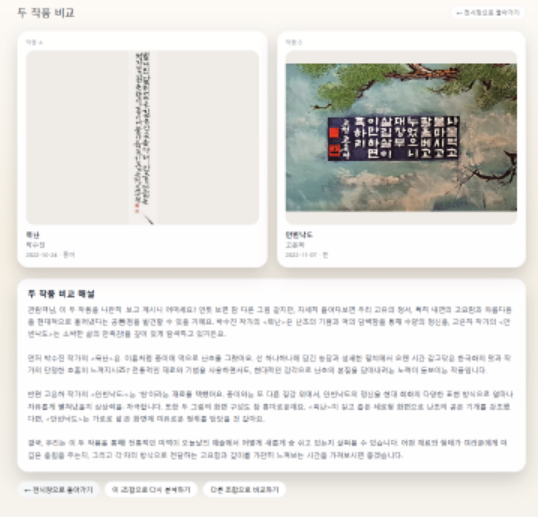

# 🏛️ AI기반 문화예술 도슨트 서비스

## ✨ 개요
**AI기반 문화예술 도슨트 서비스**는 멀티모달 RAG 기반 **개인 맞춤형 전시 경험을 위한 인공지능 솔루션 시스템**입니다.

전시 작품 데이터를 기반으로 텍스트·이미지·음성 멀티모달 AI 도슨트를 제공하는 웹 서비스입니다.
사용자의 자연어 요청을 이해하고, 작품 해설·추천·비교까지 수행하는 AI Agent 기반 큐레이션 시스템입니다.

기존 전시 서비스의 단순 정보 제공을 넘어,
개인 맞춤형 해설과 인터랙티브 경험을 제공하는 것을 목표로 합니다.


## 📖 프로젝트 소개
사용자는 전시 작품을 탐색하면서  
AI가 생성한 작품 해설을 듣거나, 유사 작품을 추천받고,  
두 작품을 비교 분석하는 **몰입형 디지털 전시 경험**을 할 수 있습니다.

기존 전시 서비스가 단순한 이미지와 텍스트 설명 중심이었다면  
Museum Agent는 **텍스트 RAG + 이미지 RAG + Vision 모델**을 결합하여  
사용자의 질문과 의도에 맞는 **지능형 전시 해설 서비스**를 제공합니다.

본 프로젝트는 **프론트엔드·백엔드·AI 역할을 분담한 팀 프로젝트**로,
멀티모달 AI 도슨트 서비스를 실제 웹 애플리케이션 형태로 구현했습니다.

## 👥 팀 구성 및 역할

| 이름 | 역할 |
|------|------|
| 황재윤 | Frontend / Backend / AI |
| 이지영 | Frontend / AI |
| 장수진 | Backend / AI |

## 🎯 문제 정의
- 전시 데이터 증가 → 자동 해설 체계 부족
- LLM 단독 사용 시 Hallucination 문제 발생
- 기존 전시는 정적 정보 제공 → 사용자 경험 부족

👉 해결 방향

- RAG 기반 데이터 중심 응답 구조 설계
- 텍스트 + 이미지 + 음성 결합한 멀티모달 도슨트


## 🚀 주요 기능

1️⃣ 자동 작품 해설
- 메타데이터 + RAG 기반 설명 생성
- Gemini 기반 자연어 생성

2️⃣ 유사 작품 추천
- CLIP 이미지 임베딩 기반 유사도 검색
- 스타일·주제 기반 추천

3️⃣ 몰입형 감상
- 이미지 줌 / 인터랙션
- TTS 기반 음성 해설 제공

4️⃣ 작품 비교 분석
- 두 작품을 비교하여
  - 스타일
  - 재료
  - 시대적 맥락 설명

5️⃣ AI 라우팅 Agent
- 사용자 의도 분석 후 기능 자동 연결
- Rule-based + LLM hybrid 구조

## 🧠 핵심 기술

📌 RAG (Retrieval-Augmented Generation)

- 텍스트 RAG: Gemini embedding + ChromaDB
- 이미지 RAG: CLIP embedding + ChromaDB

📌 멀티모달 처리
- 텍스트: Gemini 2.5 Flash
- 이미지: OpenCLIP (ViT-B/32)
- 음성: Google Cloud TTS

📌 AI Agent 구조
- Rule-based + 키워드 매칭 + LLM fallback
- 기능별 라우팅 (해설 / 추천 / 비교)

👉 단순 LLM이 아닌
RAG + Vision + Agent가 결합된 구조

## 🛠️ 기술 스택
Frontend
- React + Vite
- React Router
- TailwindCSS
  
Backend
- FastAPI
- Python
  
AI / Data
- Gemini API (텍스트 생성 + 임베딩)
- OpenCLIP (이미지 임베딩)
- ChromaDB (벡터 검색)
- Google Cloud TTS

# 📂 데이터

프로젝트에서는 **AI Hub 디지털 K-Art 데이터셋**을 활용했습니다.

## 데이터 구성

### 이미지 데이터
- 약 **92,547장** 작품 이미지 (JPG)

### 메타데이터
- 작품 제목
- 작가
- 시대
- 소재
- 작품 설명

### 메타데이터 예시

```json
{
  "MainCategory": "현대",
  "SubCategory": "한국화",
  "Title": "Intention",
  "ArtistName": "김영재",
  "Material": "종이"
}
```

## 🖥️ 서비스 실행 화면
### 🏠 메인 갤러리
- 작품 리스트 및 필터링 제공
<p align="center">
  
</p>

### 📄 작품 상세 페이지
- AI 해설 + 유사 작품 추천
<p align="center">
  
</p>

### 🎧 몰입형 감상
- TTS 기반 음성 해설 + 인터랙션
<p align="center">
  
</p>

### 🔍 작품 비교 기능
- 두 작품의 스타일/맥락 비교 분석
<p align="center">
  
</p>

## 🤝 협업 방식

- 역할 분담 기반 병렬 개발
- API 명세 기반 프론트-백엔드 협업
- GitHub PR 및 코드 리뷰 진행
- Notion 기반 일정 및 기능 관리

